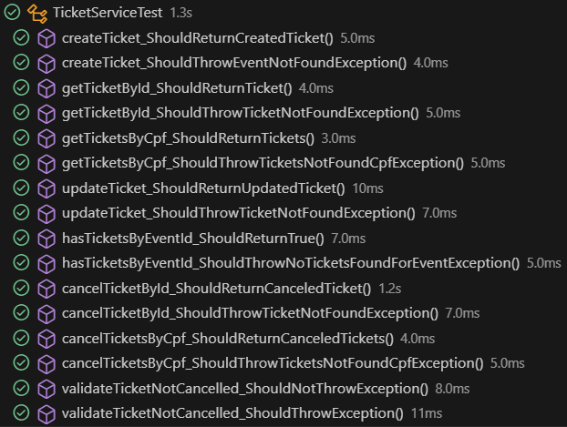

# Projeto de Microservices - Events & Tickets (Desafio 3 Compass UOL)


## Visão Geral
Este projeto implementa um sistema baseado em microserviços para gerenciamento de eventos e tickets. Os microserviços se comunicam entre si e armazenam dados em um banco de dados MongoDB. O deploy foi realizado na AWS utilizando três instâncias EC2: uma para cada microserviço e outra para o MongoDB.

## Tecnologias Utilizadas
- **Java** com **Spring Boot**
- **MongoDB** como banco de dados
- **OpenFeign** para comunicação entre microserviços
- **OpenAPI/Swagger** para documentação dos endpoints
- **JUnit e Mockito** para testes
- **AWS EC2** para deploy

## Arquitetura do Sistema
- **Microserviço de Events**: Responsável pelo gerenciamento de eventos.
- **Microserviço de Tickets**: Responsável pelo gerenciamento de tickets associados a eventos.
- **MongoDB**: Banco de dados utilizado por ambos os microserviços.

## Como Executar Localmente
1. Clone o repositório:
   ```sh
   git clone https://github.com/luixsouza/Desafio3_Compass.git
   ```
   
###  **No IntelliJ IDEA**

1.  **Importe o projeto como Maven**.
2.  **Execute as classes principais:**
    -   `MsEventManagerApplication` (porta `8080`)
    -   `MsTicketManagerApplication` (porta `8081`)

###  **No VS Code**

1.  **Instale as extensões:** Java Extension Pack e Spring Boot Extension Pack.
2.  **Compile e rode:**
    
    ```sh
    mvn clean install
    mvn spring-boot:run
    
    ```
4. Acesse a documentação da API no navegador. Você também pode testar a API pelo Swagger se assim preferir. :D

   **Events:**
   ```
   http://localhost:8080/swagger-ui.html
   ```
   **Tickets**
   ```
   http://localhost:8081/swagger-ui.html
   ```
## Testando a API com o Postman

Para testar a aplicação, você pode importar a coleção do Postman contendo as requisições de teste.

1. Baixe a coleção em formato JSON [aqui](https://github.com/luixsouza/Desafio3_Compass/blob/main/collection-postman/Desafio3-Compass.postman_collection.json).
2. Abra o **Postman** e clique em **Import**.
3. Selecione o arquivo JSON baixado e clique em **Importar**.
4. A coleção será carregada no Postman, para sua comodidade você poderá começar a testar os endpoints da aplicação com os dados previamente mockados.

Certifique-se de que a aplicação esteja em execução antes de testar as requisições.

Consulte os dados no **MongoDB Compass** em `db_event` e `db_ticket`.

**Observação:** Após realizar as requisições **POST**, o **MongoDB** cria automaticamente as coleções correspondentes, caso elas ainda não existam. Isso significa que não é necessário criar as coleções manualmente antes de realizar as operações de inserção de dados.

## Estrutura de Pacotes

### Microserviço de Eventos (ms-event-manager)
```plaintext
src/main/java/com/compass/ms_event_manager/
│── client/
│   ├── TicketClient.java (Cliente Feign para comunicação com o serviço de tickets)
│   ├── ViaCepClient.java (Cliente Feign para buscar endereços via API do ViaCep)
│── config/
│   ├── SpringDocOpenApiConfig.java (Configuração do Swagger para documentação da API)
│── controller/
│   ├── EventController.java (Controlador responsável pelos endpoints do serviço de eventos)
│── dto/
│   ├── AddressDTO.java (Objeto de transferência de dados para endereços)
│   ├── CheckTicketsResponseDTO.java (DTO para validar tickets associados a eventos)
│── exception/
│   ├── EventCreationException.java (Exceção para erro na criação de eventos)
│   ├── EventDeletionException.java (Exceção para erro na exclusão de eventos)
│   ├── EventNotFoundException.java (Exceção para evento não encontrado)
│   ├── EventRetrievalException.java (Exceção para erro na recuperação de eventos)
│   ├── EventUpdateException.java (Exceção para erro na atualização de eventos)
│   ├── GlobalExceptionHandler.java (Mecanismo de captura de exceções globais)
│   ├── InvalidEventDataException.java (Exceção para dados inválidos de eventos)
│   ├── TicketServiceUnavailableException.java (Exceção quando o serviço de tickets está indisponível)
│── mapper/
│   ├── EventMapper.java (Classe para conversão entre entidades e DTOs de eventos)
│── model/
│   ├── Event.java (Modelo da entidade de eventos)
│── repository/
│   ├── EventRepository.java (Interface para acesso ao banco de dados MongoDB)
│── service/
│   ├── EventService.java (Serviço responsável pela lógica de negócios relacionada a eventos)
│── MsEventManagerApplication.java (Classe principal que inicializa a aplicação Spring Boot)

```

### Microserviço de Tickets (ms-ticket-manager)
```plaintext
src/main/java/com/compass/ms_ticket_manager/
│── client/
│   ├── EventClient.java (Cliente Feign para comunicação com o serviço de eventos)
│── config/
│   ├── SpringDocOpenApiConfig.java (Configuração do Swagger para documentação da API)
│── controller/
│   ├── TicketController.java (Controlador responsável pelos endpoints do serviço de tickets)
│── dto/
│   ├── CheckTicketsResponseDTO.java (DTO para validação de tickets)
│   ├── TicketDTO.java (DTO para transferência de dados de tickets)
│── exception/
│   ├── EventNotFoundException.java (Exceção para evento não encontrado)
│   ├── GlobalExceptionHandler.java (Mecanismo de captura de exceções globais)
│   ├── NoTicketsFoundForEventException.java (Exceção quando não há tickets para um evento)
│   ├── TicketCancelledException.java (Exceção para ticket cancelado)
│   ├── TicketNotFoundException.java (Exceção para ticket não encontrado)
│   ├── TicketsNotFoundCpfException.java (Exceção para CPF sem tickets)
│── mapper/
│   ├── TicketMapper.java (Classe para conversão entre entidades e DTOs de tickets)
│── model/
│   ├── Event.java (Modelo da entidade de eventos relacionado ao ticket)
│   ├── Ticket.java (Modelo da entidade de tickets)
│── repository/
│   ├── TicketRepository.java (Repositório para persistência de tickets)
│── service/
│   ├── TicketService.java (Serviço responsável pela lógica de negócios relacionada a tickets)
│── validator/
│   ├── TicketValidator.java (Valida os dados dos tickets antes de serem processados ou persistidos)
│── MsTicketManagerApplication.java (Classe principal que inicializa a aplicação Spring Boot)
```

## Resumo do Deploy na AWS

Este deploy configura três instâncias EC2 (`t2.micro`) na AWS (`sa-east-1a`): `ms-ticket-manager`, `ms-event-manager` e `mongodb`. Utiliza um Security Group personalizado com acesso às portas `8080`, `8081` e `27017`, e acesso SSH via chave SSH.

## Passo a Passo

1.  **Criar Security Group:** Portas `22`, `8080`, `8081`, `27017`.
2.  **Criar Instâncias:** `t2.micro` com o Security Group e chave SSH.
3.  **Configurar Instâncias:** Instalar e configurar softwares.
4.  **Verificar:** Acessar portas `8080`, `8081` e `27017`.

### Instâncias AWS


### Microservices em Execução


### Documentação da API com Swagger
A API foi documentada usando **Swagger**, fornecendo uma interface interativa para explorar e testar os endpoints. Todos os casos de exceptions foram tratados e detalhados na documentação, garantindo clareza e facilitando a integração.

### Events


### Tickets


### Testes Unitários E Cobertura
A aplicação foi testada de forma abrangente utilizando **JUnit** e **Mockito**. Testes foram implementados para as camadas de Controller e Service de ambos os microserviços, garantindo excelente cobertura, qualidade e confiabilidade do código.

### Cobertura de Testes
#### Events
**Controller**  


**Service**  


#### Tickets
**Controller**  


**Service**  


### Resultados dos Testes
#### Events
**Controller**  


**Service**  


#### Tickets
**Controller**  


**Service**  



## Agradecimentos
Agradeço à **Compass UOL** por toda a oportunidade e aprendizado. Sem demagogias, é realmente um lugar de pessoas incríveis. Foi uma experiência incrível poder colaborar e crescer com o time. Valeu demais, pessoal! <3

## Autor
[luixsouza](https://github.com/luixsouza)